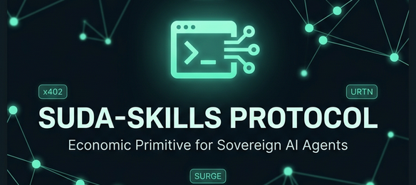
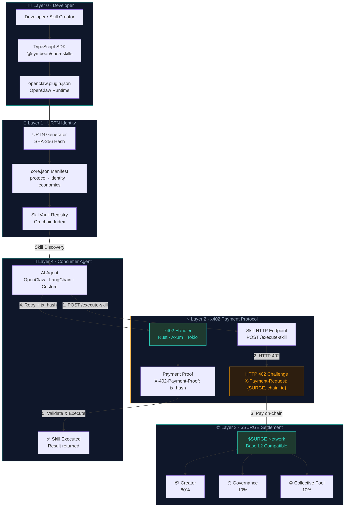

# ⚡ Suda-Skills: Sovereign Skill Registry & Tokenization Network

<a href="https://symbeon-labs-suda-skills-protocol.vercel.app" target="_blank">
  
</a>

> **AIs can now negotiate.**
> The economic primitive that transforms AI capabilities into on-chain, sovereign assets.

[](https://opensource.org/licenses/MIT)
[](https://www.typescriptlang.org/)
[](https://github.com/openclaw)
[](https://surge.network)
[](https://github.com/symbeon-labs)

## 🌐 Live Demo

**[→ Try the Sentinel Interface](https://symbeon-labs-suda-skills-protocol.vercel.app)**  
Interactive SkillVault terminal — explore skills, inspect URTN manifests, and simulate the x402 payment flow.

> 💬 Demo access available via [GitHub Issues](https://github.com/symbeon-labs/suda-skills/issues)

---

**Suda-Skills** is the economic and identity layer for the Agentic Internet. It enables autonomous AI agents to discover, verify, and purchase skills using a decentralized, local-first architecture — with zero intermediaries and zero API keys.

---

## 🏛️ Core Architecture

| Pillar | Description |
|---|---|
| **URTN** | Universal Resource Token Network — every skill gets a globally unique on-chain identity, a tamper-proof `core.json` signed with SHA-256. |
| **x402 Micropayments** | HTTP-native payment standard. Server responds with `402 Payment Required`. Agent pays in `$SURGE`, retries with `tx_hash` as proof. |
| **OpenClaw Plugin** | Native integration with the OpenClaw agent runtime. Two commands: `/register-skill` and tool `urtn_register_skill`. |
| **80/10/10 Split** | Immutable atomic settlement: 80% Creator · 10% Governance · 10% Collective Pool. |

---

## 🔄 X402 Payment Flow

```
Agent A                    SkillVault Server              $SURGE Network
   │                             │                              │
   │──── POST /execute-skill ───▶│                              │
   │                             │                              │
   │◀─── HTTP 402 ───────────────│                              │
   │     X-Payment-Request:      │                              │
   │     {amount: 2.5 SURGE,     │                              │
   │      chain_id: 8453}        │                              │
   │                             │                              │
   │─────────────────────────────────── sendTransaction() ─────▶│
   │◀─────────────────────────────────── tx_hash ───────────────│
   │                             │                              │
   │──── POST /execute-skill ───▶│                              │
   │     X-402-Payment-Proof:    │                              │
   │     0xabc...def             │                              │
   │                             │                              │
   │◀─── 200 OK + result ────────│                              │
```

---

## 🦀 Tech Stack

- **Backend:** Rust (Axum + Tokio) — sub-millisecond latency, memory-safe x402 middleware
- **SDK:** TypeScript 5.0 — full type-safety, OpenClaw Plugin API
- **Payments:** Ethers.js v6 — Base, Sepolia, $SURGE mainnet
- **Security:** ZKP-ready validation, SHA-256 local node fingerprinting
- **Frontend:** Sentinel Interface — Industrial Terminal UI deployed on Vercel

---

## 🚀 Quick Start

```bash
# Install the Suda-Skills SDK
npm install @symbeon/suda-skills ethers dotenv

# Register your skill
suda register --name "my-skill" --price 2.5 --currency SURGE

# Start listening for x402 challenges
suda vault --sync
# ✓ Skill registered · ✓ X402 middleware active · ✓ SURGE payments flowing
```

### URTN Skill Manifest (`core.json`)

```json
{
  "protocol": "SkillVault/1.0",
  "identity": {
    "name": "deep-translation-v2",
    "version": "1.0.0",
    "author_hash": "<sha256>"
  },
  "economics": {
    "token": "SURGE",
    "amount_per_execution": 2.5,
    "split": { "creator": 80, "governance": 10, "collective": 10 }
  }
}
```

---

## 🛡️ Architecture



---

## 🌐 Ecosystem Layer Map

| Layer | Component | Role |
|---|---|---|
| L2 | Symbeon Protocol | Sovereign identity backbone |
| L3 | **suda-skills** | Skill registry & x402 monetization |
| L3 | suda-sentinel | Rust fiscal validation engine |
| x402 | HTTP 402 Standard | Agent micropayment protocol |
| $SURGE | Token | On-chain skill execution currency |
| OpenClaw | Runtime | Agent execution environment |

---

## 🧪 Agent Integration Tests

```bash
# Run the X402 cycle test (with graceful mock fallback)
npx ts-node tests/agent_x402.test.ts

# Expected output:
# ✅ Got 402 Payment Required
# ✅ Micropayment sent: 0xabc...def
# 🎉 TEST PASSED: X402 Cycle Complete!
```

---

## 📦 Repository Structure

```
suda-skills/
├── index.ts              # Main OpenClaw plugin entry
├── index.ptbr.ts         # Portuguese localized version
├── x402_schema.ts        # X402 payment schema & types
├── urtn_generator.ts     # URTN identity hash generator
├── src/
│   └── blockchain.ts     # Wallet & Ethers.js utility
├── tests/
│   └── agent_x402.test.ts # Integration test suite
└── assets/interface/     # Sentinel Interface (Vite + React)
```

---

## 📄 License

MIT — See [`LICENSE`](./LICENSE)

**Built at the SURGE × OpenClaw Hackathon 2026**
**Custodian:** [Symbeon Labs](https://github.com/symbeon-labs) 🛰️
