# 🏛️ suda-skills

> **The Intelligent Skill Registry for Sovereign Agents.**  
> Register with URTN · Monetize with L402 · Scale with Symbeon Protocol

[](https://opensource.org/licenses/MIT)
[](https://www.typescriptlang.org/)
[](https://github.com/openclaw)
[](https://github.com/symbeon-labs)


**suda-skills** is an OpenClaw plugin implementing the **URTN (Universal Registry & Automated-Tokenization Network)** — a deterministic framework for the cryptographic registration and cross-agent execution of autonomous cognitive modules.

### 🌐 Official Sovereign Interface
The ecosystem is accessible via the **[@SYMBEON_BOT](https://t.me/SYMBEON_BOT)** on Telegram, providing a multi-model agnostic interface (Gemini 1.5/3, Llama 3) for real-time protocol management.

---

## 🛠️ Technical Capabilities

- **Deterministic Skill Anchoring** — Cryptographic derivation of SHA-256 identity hashes for immutable cognitive module registration.
- **L402 Micropayment Engine** — Integrated state-machine for atomic, agent-to-agent resource allocation via the L402 (Lightning/HTTP 402) standard.
- **Fiscal Guard (Rust)** — Low-latency bridge to the `suda-sentinel` Rust engine for blinded permit validation and memory-safe execution verification.
- **Runtime Native Integration** — Direct memory-mapped access to the OpenClaw execution context for autonomous skill provisioning.

---

## 🎓 Scientific Authority

This project has been auditied by the **Themis Engine** (Juridical Innovation Agent) and reached an **Innovation Score of 83/100**.

- **Technical Whitepaper**: [URTN-Nexus: A Sovereign Framework for Autonomous Agent Skill Tokenization](./docs/authority_paper.tex)
- **Vectors**: H=0.923 (Entropy), Z=1.000 (Zipf), C=0.500 (Compliance)
- **Innovation Audit**: Validated as a patentable technical method for deterministic cognitive discovery.

---

## 🚀 Quick Start

### Prerequisites
- [Node.js](https://nodejs.org/) 18+
- [OpenClaw](https://github.com/openclaw) runtime
- TypeScript 5.0+

### Installation

```bash
git clone https://github.com/symbeon-labs/suda-skills.git
cd suda-skills
npm install
npm run build
```

### Register as an OpenClaw Plugin

Point your `openclaw.plugin.json` at the built output and restart the runtime. The plugin registers two capabilities automatically:

| Capability | Type | Description |
|---|---|---|
| `/register-skill` | Command | Register a skill interactively |
| `urtn_register_skill` | AI Tool | Let the agent self-register autonomously |

---

## 🔑 Protocol: URTN

Every registered skill produces a `core.json` manifest:

```json
{
  "protocol": "SkillVault/1.0",
  "identity": {
    "name": "my-skill",
    "description": "Does something sovereign",
    "version": "1.0.0",
    "author_hash": "<sha256>"
  },
  "economics": {
    "token": "SURGE",
    "amount_per_execution": 10,
    "royalty_bps": 300
  }
}
```

See [`SPEC.md`](./SPEC.md) for the full protocol specification.

---

## 🛡️ Architecture

### System Overview

```mermaid
graph TD
    A["👤 Architect / Developer"] -->|"/register-protocol"| B["OpenClaw Runtime"]
    B --> C["URTN-Nexus Extension"]
    C --> D["core.json (Manifest)"]
    D --> E["Sovereign Registry\n(L1 Node + On-chain)"]

    F["🤖 Consumer Node\n(Skill Requester)"] -->|"Discovery"| E
    E -->|"L402 Payment Request"| G["L402 Handler"]
    G -->|"$SURGE Transfer"| H["💳 Creator Node\n(80% Settlement)"]
    G -->|"$SURGE Transfer"| I["⚖️ L0 Governance\n(10%)"]
    G -->|"$SURGE Transfer"| J["🌐 Collective Fund\n(10%)"]
    H --> K["✅ Execution permit issued"]

    L["🧬 Sentinel Engine\n(Sovereign Validation)"] --- C
    L -->|"Verifies Integrity"| D

    style C fill:#1a1a2e,color:#00ffcc,stroke:#00ffcc
    style D fill:#1a1a2e,color:#ffd700,stroke:#ffd700
    style E fill:#1a1a2e,color:#00ffcc,stroke:#00ffcc
    style G fill:#16213e,color:#ffd700,stroke:#ffd700
    style L fill:#1a1a2e,color:#00ffcc,stroke:#00ffcc,stroke-dasharray: 5 5
```



### Component Breakdown

- **URTN Generator** — Produces immutable SHA-256 identity hashes.
- **L402 Handler** — Orchestrates atomic agent-to-agent settlement.
- **suda-sentinel** — High-performance Rust engine for permit validation.

---

## 🌐 Ecosystem

| Layer | Component | Role |
|---|---|---|
| L2 | Symbeon Protocol | Sovereign identity backbone |
| L3 | suda-skills | Skill registry & monetization |
| L3 | suda-sentinel | Fiscal validation engine (Rust) |
| L402 | HTTP 402 | Agent micropayment standard |
| $SURGE | Token | On-chain skill execution currency |

---

## 📄 License

MIT — See [`LICENSE`](./LICENSE)

**Custodian:** [Symbeon Labs](https://github.com/symbeon-labs)
