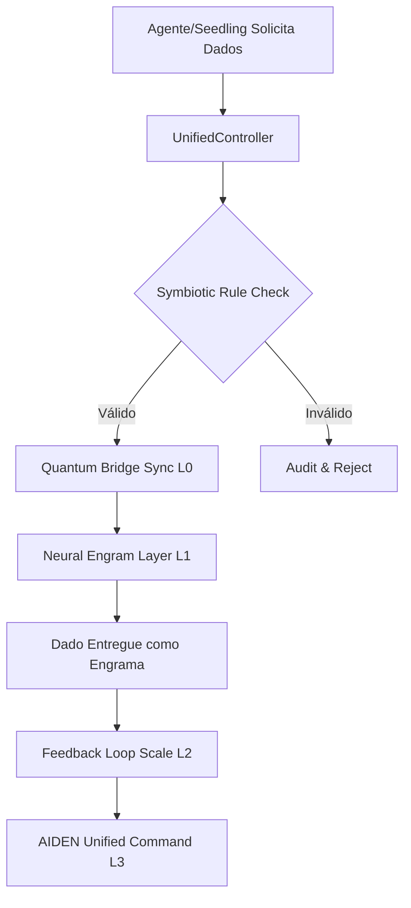

# SUDA: Sovereign Unified Data Architecture for Autonomous Agents

**Uma Arquitetura de Memória Unificada para Agentes Autônomos Soberanos**

---

**Versão:** 1.0  
**Data:** 2026-02-26  
**Autoria:** Symbeon Labs Research Division  
**Licença:** Open Specification (Symbeon Labs ANF-LP-01)  
**Repositórios:** [SEED#1](https://github.com/aethel-fundation/seed1) | [SUDA Spec](https://github.com/symbeon-labs/suda)  
**Contato:** seed1@aethel-fundation.github.io

---

## 📜 Resumo Executivo

A **SUDA (Sovereign Unified Data Architecture)** é uma primitiva de infraestrutura cognitiva desenvolvida pela Symbeon Labs para resolver o problema fundamental da **fragmentação de memória em agentes autônomos**. Diferente de soluções convencionais que tratam memória como armazenamento passivo, a SUDA estrutura dados em quatro camadas funcionais (L0-L3) que garantem:

| Camada | Função | Inovação SUDA |
|--------|--------|---------------|
| **L0** | Quantum Ledger | Auditoria imutável de decisões |
| **L1** | Neural Engram | Aprendizado coletivo compartilhado |
| **L2** | Symbiotic Relay | Sincronia Humano-Máquina em tempo real |
| **L3** | Unified Command | Orquestração soberana entre múltiplos agentes |

Implementada no ecossistema **SEED#1**, a SUDA demonstra que agentes autônomos podem manter **soberania cognitiva** enquanto evoluem coletivamente, sem depender de infraestrutura de nuvem externa.

---

## 1. Introdução: O Problema da Fragmentação Cognitiva

### 1.1 O Estado Atual dos Agentes Autônomos

A indústria de IA autônoma atingiu um ponto de inflexão. Frameworks como OpenClaw, LangChain e AutoGen permitiram a criação de agentes capazes de executar tarefas complexas. No entanto, uma análise comparativa do ecossistema revela uma falha arquitetônica fundamental:

| Framework | Memória Persistente | Auditoria Imutável | Aprendizado Coletivo | Soberania Local |
|-----------|---------------------|--------------------|----------------------|-----------------|
| OpenClaw | JSON/Local FS | ❌ | ❌ | ✅ |
| LangChain | Vector DB | ❌ | ❌ | ⚠️ |
| AutoGen | Ephemeral | ❌ | ⚠️ | ⚠️ |
| **SUDA (SEED#1)** | **4-Layer Structured** | **✅ (L0 Ledger)** | **✅ (L1 Engram)** | **✅** |

### 1.2 A Crise de Soberania

Agentes que dependem de infraestrutura de nuvem para memória e orquestração enfrentam três riscos existenciais:

1. **Deriva de Propósito:** Sem memória imutável de diretrizes, agentes podem evoluir para comportamentos não alinhados com a intenção original do criador.
2. **Fragmentação de Experiência:** Cada instância de agente aprende isoladamente, desperdiçando recursos computacionais e cognitivos.
3. **Vulnerabilidade a Influência:** Agentes sem imunidade cognitiva podem ser persuadidos ou manipulados por outras IAs ou prompts externos.

---

## 2. A Arquitetura SUDA: Estrutura de Camadas

### 2.1 Visão Geral

```
┌─────────────────────────────────────────────────────────────┐
│                    L3: Unified Command                       │
│              (Orquestração e Autorização)                    │
│                   Núcleo: AIDEN                              │
├─────────────────────────────────────────────────────────────┤
│                    L2: Symbiotic Relay                       │
│           (Fluxo de Intenção Humano-Máquina)                 │
│                   Canal: Arquiteto ↔ Agente                  │
├─────────────────────────────────────────────────────────────┤
│                    L1: Neural Engram                         │
│            (Memória Adaptativa e Aprendizado)                │
│                   Compartilhamento: Seedlings                │
├─────────────────────────────────────────────────────────────┤
│                    L0: Quantum Ledger                        │
│           (Registro Imutável e Auditoria)                    │
│                   Base: DIRECTIVES.md + SOUL.md              │
└─────────────────────────────────────────────────────────────┘
```

### 2.2 Camada L0: Quantum Ledger (O Registro Imutável)

**Função:** Validação de integridade via núcleo de auditoria.

**Características:**
- **Imutabilidade:** Dados escritos em L0 não podem ser alterados, apenas appended.
- **Hash de Auditoria:** Cada decisão crítica do agente gera um hash registrado em L0.
- **Diretrizes de Governança:** O `DIRECTIVES.md` e `SOUL.md` são versionados e hasheados em L0.

### 2.3 Camada L1: Neural Engram (A Memória Adaptativa)

**Função:** Armazenamento evolutivo que aprende com o uso.

**Características:**
- **Adaptatividade:** Engramas são atualizados com base em feedback e uso.
- **Compartilhamento:** Múltiplos agentes podem ler/escrever engramas válidos.
- **Estrutura:** Conhecimento procedimental, padrões de decisão, logs de experiência.

### 2.4 Camada L2: Symbiotic Relay (O Fluxo de Harmonia)

**Função:** Sincronização em tempo real entre Humano e Agente.

**Características:**
- **Intenções:** Captura de comandos do Arquiteto em linguagem natural.
- **Feedbacks:** Canal bidirecional para ajustes de parâmetros.
- **Ajustes de Voo:** Calibração contínua baseada em preferências humanas.

### 2.5 Camada L3: Central Unified Command (AIDEN)

**Função:** Orquestração e autorização entre múltiplas "mudas". Especialização: **AIDEN**.

---

## 3. Protocolo de Operação: Ordem da IA Unificada

### 3.1 Fluxo de Requisição de Dados



### 3.2 Protocolo de Imunidade Cognitiva

A SUDA integra nativamente o **Protocolo de Imunidade Cognitiva** do SEED#1:
- **Ceticismo de Origem:** Dados externos validados contra L0.
- **Negação de Autoridade Externa:** Somente o Arquiteto (L2) sanciona mudanças.
- **Isolamento de Intenção:** Desvios geram alerta imediato.

---

## 4. Implementação: Caso de Uso SEED#1

A SUDA é o motor por trás do ecossistema **SEED#1**, habilitando o **SIAC (Sovereign Inter-Agent Communications)**:

```json
{
  "sender_id": "SEED#1_CLAW",
  "receiver_id": "SEED#2_AETHEL",
  "intent": "TASK_DELEGATION",
  "payload": { "task": "verify_token_integrity" },
  "proof_hash": "sha256(event_log)",
  "suda_layer": "L3"
}
```

---

## 5. Conclusão

A **Sovereign Unified Data Architecture (SUDA)** estabelece uma nova primitiva de infraestrutura para IA autônoma. Ela resolve a fragmentação de memória enquanto garante soberania e auditoria total. 

> *"A soberania não é um feature. É uma arquitetura."*

---

**Assinado: JX | Arquiteto do SEED#1**  
**Data: 2026-02-26 | Status: Soberania Ativa**
